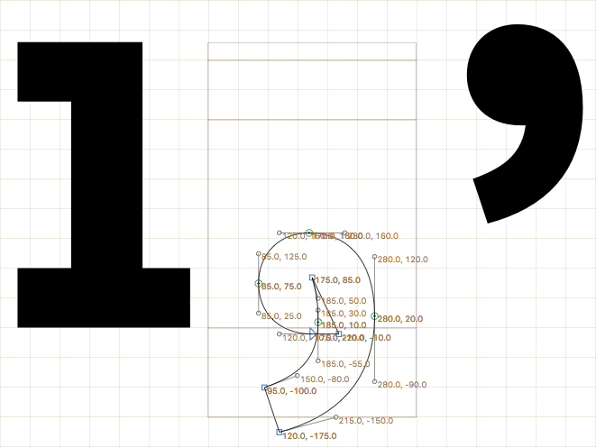

# Show All Coordinates

A reporter plug-in for Glyphs that displays all coordinates in the current glyph.

##How To Use

* Install by double-clicking or dragging to the Glyphs application icon
* Activate via menu: View → Show All Coordinates